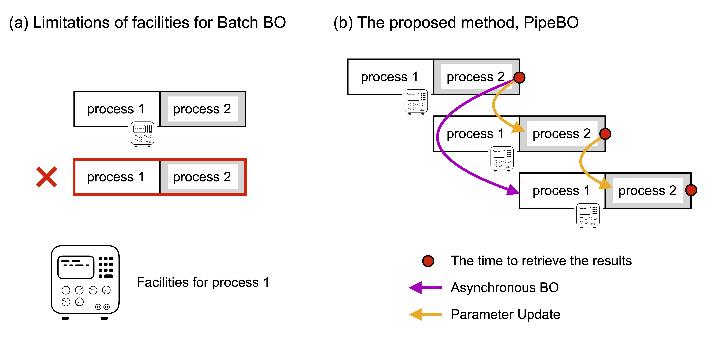

# PipeBO: Piepelining Bayesian optimization

This is the code for [title]().
This project is carried out in [Funahashi Lab. at Keio University](https://fun.bio.keio.ac.jp/)

## Overview
PipeBO is a Bayesian optimizaiton method that performs parallelization through pipelining.
Pipelining enables parallelization of experiments where batch Bayesian optimization cannot be applied due to equipement limitations.
The implementation is based on GPyOpt [[1](#ref1)].




## Requirements

- [Python 3.9](https://www.python.org/downloads/)
- [coco-experiment](https://pypi.org/project/coco-experiment/)
- [Matplotlib](https://matplotlib.org/)
- [NumPy <2.0.0](http://www.numpy.or)
- [SciPy <=1.12.0](http://www.scipy.org)
- [Pandas](https://pandas.pydata.org/)
- [GPy]()

See ```requirements.txt``` for details

## QuickStart

1. Download this repository by `git clone`.
    ```sh
    % git clone git@github.com:funalab/PipeBO.git
    ```
2. Install requirements.
    ```sh
    % cd pipebo/
    % python -m venv venv
    % source ./venv/bin/activate
    % pip install --upgrade pip
    % pip install -r requiremets.txt
    % cd src/gpyopt
    % python setup.py develop
    ```
3. Run PipeBO with benchmark function.
    ```sh
    % cd pipebo/src/
    % python main.py -bf f01_i01 -json ../confs/example.json  -rs 1 -iter 10
    ```

## Reproduce the figure in the paper
Download data from [here](https://drive.google.com/file/d/1FjqTohtbwMSv4bAEDmB9C5an3qre7jYw/view?usp=drive_link).
The source code is in `src/makefig/`.

## Acknowledgement
The development of this algorithm was funded by JST CREST (Grant Number JPMJCR21N1) to [Akira Funahashi](https://github.com/funasoul).

## References
<a id="ref1"></a>[[1] The GPyOpt authors, GPyOpt: A Bayesian Optimizaiton framework in python (2016).](https://github.com/SheffieldML/GPyOpt)